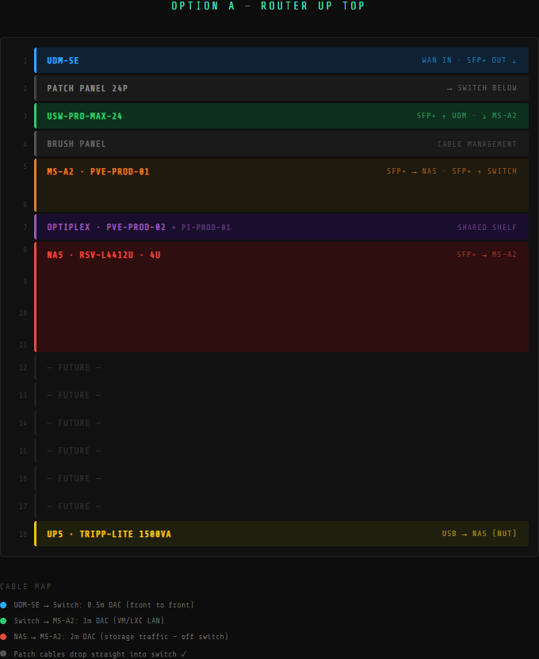

# Rack Layout

**Last Updated:** 2026-03-10 **Rack:** StarTech 4POSTRACK18U (18U open-frame) **Status:** Built

---

## Unit Layout




```
U1  │ UniFi UDM-SE                  │ Router / Firewall
U2  │ UniFi UP-PATCH-24             │ Patch Panel (keystone)
U3  │ UniFi USW-Pro-Max-24          │ Core Switch
U4  │ Brush Panel                   │ Cable management
U5  │ Minisforum MS-A2              │ pve-prod-01 (2U custom bracket)
U6  │ Minisforum MS-A2              │ ↑ continued
U7  │ Dell Optiplex 3070 + Pi       │ pve-prod-02 (1U shelf) + pi-prod-01 sharing shelf
U8  │ Rosewill RSV-L4412U           │ nas-prod-01 (4U)
U9  │ Rosewill RSV-L4412U           │ ↑ continued
U10 │ Rosewill RSV-L4412U           │ ↑ continued
U11 │ Rosewill RSV-L4412U           │ ↑ continued
U12 │ [Empty]                       │
U13 │ [Empty]                       │
U14 │ [Empty]                       │
U15 │ [Empty]                       │
U16 │ [Empty]                       │
U17 │ [Empty]                       │
U18 │ Tripp-Lite SMART1500LCDXL     │ UPS (bottom)
```

---

## Non-Rack Devices

|Device|Location|IP|Notes|
|---|---|---|---|
|U6-Pro AP|Wall/ceiling mount|192.168.10.200|PoE via UDM-SE port 7. VLAN 10 Management.|

---

## DAC Cable Map

|Cable|Length|From|To|Purpose|
|---|---|---|---|---|
|10Gtek DAC|0.5M|UDM-SE SFP+|Switch SFP+ Port 1|WAN/LAN uplink between router and switch|
|Cable Matters DAC|2M|nas-prod-01 X710 Port 1|pve-prod-01 SFP+ Port 1|Storage traffic — dedicated point-to-point, off LAN switch|
|Cable Matters DAC|2M|nas-prod-01 X710 Port 2|Switch SFP+ Port 2|NAS data/NFS interface to switch (VLAN 30)|

**Notes:**

- MS-A2 connects to the switch via its **2.5GbE RJ45**, not SFP+. Both SFP+ ports on the MS-A2 are used for the direct NAS storage link only.
- 2M DAC for NAS ↔ MS-A2 accounts for RSV-L4412U sliding rail extension slack (~1.5M actual path + margin)
- Storage traffic (X710 Port 1 ↔ MS-A2 SFP+ Port 1) intentionally kept off the switch — isolated 10GbE link between NAS and primary compute only

---

## RJ45 Uplinks to Switch

|Device|Interface|Speed|Switch Port|VLAN Profile|
|---|---|---|---|---|
|UDM-SE|2.5GbE RJ45|2.5GbE|SW Port 26|— (uplink)|
|pve-prod-01 (MS-A2)|2.5GbE RJ45|2.5GbE|SW Port 21 (via PP19)|Trunk - All VLANs|
|nas-prod-01 onboard (TUF Z690)|2.5GbE RJ45|2.5GbE|SW Port 20 (via PP18)|Mgmt - Only|
|pve-prod-02 (Optiplex)|1GbE RJ45|1GbE|SW Port 19 (via PP17)|Trunk - All VLANs|
|pi-prod-01 (Raspberry Pi)|1GbE RJ45|1GbE|SW Port 17 (via PP15)|Trunk - All VLANs*|

*pi-prod-01 is temporarily on Trusted Access (VLAN 20) until Phase 3 cutover to VLAN 10 Management. Profile will be updated to Trunk - All VLANs at that time.

---

## UPS Outlet Map

_Tripp-Lite SMART1500LCDXL — 1500VA / 900W — 8 battery-backed outlets. 5 devices connected, 3 spare._

|Outlet|Device|Notes|
|---|---|---|
|1|UDM-SE||
|2|USW-Pro-Max-24||
|3|pve-prod-01 (MS-A2)||
|4|pve-prod-02 (Optiplex)||
|5|nas-prod-01|USB data cable from UPS → NAS for NUT|
|6|pi-prod-01|Via USB-C power adapter|
|7|[Spare]||
|8|[Spare]||

**Shutdown order on power loss (NUT managed):** Proxmox VMs + LXCs first → pve-prod-01 + pve-prod-02 → nas-prod-01 last

---

## Patch Panel → Switch Port Map

_UniFi UP-PATCH-24 at U2. Short 0.5ft Monoprice SlimRun Cat6 patch cables run from patch panel (U2) to switch (U3)._

|Patch Panel Port|Device|Cable Run|Switch Port|VLAN Profile|
|---|---|---|---|---|
|PP15|pi-prod-01 (Raspberry Pi)|Direct|SW Port 17|Trunk - All VLANs (currently Trusted Access — see note above)|
|PP16|Synology NAS|Direct|SW Port 18|Trusted Access|
|PP17|pve-prod-02 (Optiplex)|Direct|SW Port 19|Trunk - All VLANs|
|PP18|nas-prod-01 onboard 2.5GbE|Direct|SW Port 20|Mgmt - Only|
|PP19|pve-prod-01 (MS-A2)|Direct|SW Port 21|Trunk - All VLANs|
|PP20|Gio PC (Desktop)|Wall run|SW Port 22|Trusted Access|
|PP21|Cove Alarm Panel|Wall run|SW Port 23|IoT Access|
|PP22|Eufy Homebase|Wall run|SW Port 24|IoT Access|
|PP23|U6-Pro AP|Wall run|UDM-SE Port 7 (PoE)|Trunk - All VLANs|
|PP24|UDM-SE WAN|Wall run|—|—|
|SFP+ Port 1|UDM-SE SFP+|Direct DAC|SW SFP+ Port 1|— (uplink)|
|SFP+ Port 2|nas-prod-01 X710 Port 2|Direct DAC|SW SFP+ Port 2|Services Access|

**Wall runs (PP1–PP14):** Fill in as additional wall runs are terminated and labeled.

---

## Notes & Reminders

- Label both sides of every cable run: wall jack → patch panel port number → switch port number
- Verify all DAC links are showing correct link speeds in UniFi and Proxmox before proceeding with Phase 2
- RSV-L4412U ships with sliding rails — test rail extension before finalizing DAC cable lengths
- Unused switch ports 2–16 are disabled in UniFi — enable individually as devices are connected